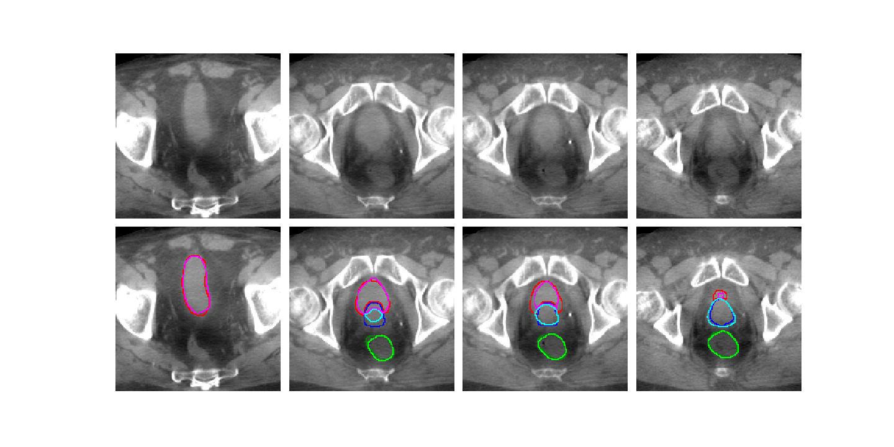

# pelvis_segmentation

This repository shows an example of code for segmenting several structures with u-net in keras and tensorflow using online data augmentation in 3D.

Get started by creating a folder named "data". In this folder, insert your images and masks in the "numpy array" format (one file per image and one file per masks). Images are expected to have a size (length, width, height), while masks are expected to be (length, width, height, n_organs+1), where n_organs is the number of structures. If for example you have two image modalities CT and Cone Beam CT (CBCT), please respect the following organization:  

data  
|-- CBCT-0-image.npy  
|-- CBCT-0-mask.npy  
|-- CBCT-1-image.npy  
|-- CBCT-1-mask.npy  
etc.  
|-- CT-0-image.npy  
|-- CT-0-mask.npy  
|-- CT-1-image.npy  
|-- CT-1-mask.npy  
etc.  

Finally, don't forget to update the beginning of each .py file of this repository with your image size, image spacing and the names of the structures to be segmented.

The file main.py shows an example of use with a 3-fold cross-validation using 63 CBCTs and 74 CTs.

Bellow is an example. Each column corresponds to a slice of the same CBCT. Dark colours represent reference segmentations, while light colours show u-net segmentation. The predicted bladder, in pink, has a DSC of 0.940, the rectum, in light green, has a DSC of 0.791, the prostate, in light blue, has a DSC of 0.780.

